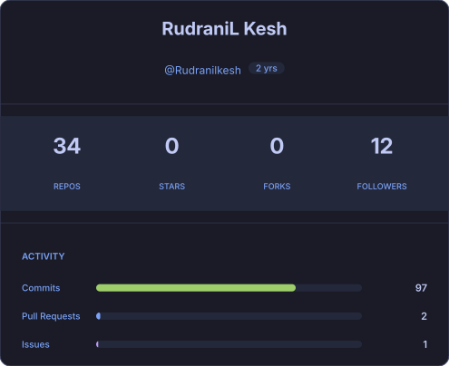
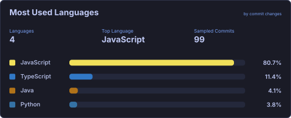
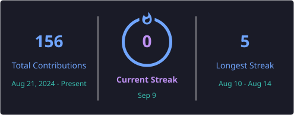
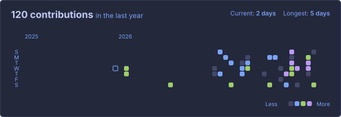
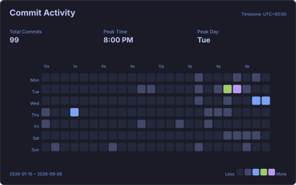

<div align="center">

# 👋 Hey, I'm RudraniL Kesh

### Full-Stack Developer • BCA Student • Backend Enthusiast • Guitarist 🎸

<p>
  <a href="https://github.com/Rudranilkesh">
    
  </a>
  <a href="https://github.com/Rudranilkesh?tab=followers">
    
  </a>
</p>

<p>
  <em>Building things, breaking things, learning why they broke — and building them better.</em>
</p>

</div>

---

## 🧑‍💻 About Me

I'm **RudraniL Kesh**, a BCA student and developer from India who enjoys turning ideas into working software.

- 🔭 Currently building **[URL_SHORTNER](https://github.com/Rudranilkesh/URL_SHORTNER)**
- 🌱 Currently learning **Data Science & AI/ML**
- 💻 Interested in **Full-Stack Development, Backend Engineering & APIs**
- 🧠 Practising **DSA, databases, system thinking and software development**
- 🎸 Outside code, I'm a **guitarist**
- 📫 Reach me at **[rudranilkesh6@gmail.com](mailto:rudranilkesh6@gmail.com)**

> **Code is the craft. Curiosity is the engine. Consistency is the multiplier.**

---

## 🌐 Connect With Me

<p align="left">
  <a href="https://www.linkedin.com/in/rudranilkesh6">
    
  </a>
  <a href="https://github.com/Rudranilkesh">
    
  </a>
  <a href="https://www.instagram.com/rudranilkesh_6">
    
  </a>
  <a href="https://www.kaggle.com/rudranilkesh">
    
  </a>
  <a href="https://leetcode.com/u/rudranilkesh/">
    
  </a>
  <a href="https://twitter.com/kesh_rudranil">
    
  </a>
</p>

---

## 🛠️ Tech Stack

### Languages

<p>
  
</p>

### Frontend

<p>
  
</p>

### Backend & Databases

<p>
  
</p>

### Tools & Platforms

<p>
  
</p>

### Data & Creative Tools

<p>
  
  
  
  
</p>

---

## 🚀 Featured Projects

<table>
<tr>
<td width="50%">

### 🔗 URL_SHORTNER

A URL-shortening project with separate frontend and backend components.

**Stack:** Backend + Frontend

<a href="https://github.com/Rudranilkesh/URL_SHORTNER"></a>

</td>
<td width="50%">

### 🌐 HTML Portfolio

A personal portfolio project focused on presenting Rudranil Kesh and frontend work.

**Stack:** HTML

<a href="https://github.com/Rudranilkesh/html-portfolio"></a>

</td>
</tr>

<tr>
<td width="50%">

### 📄 HTML Resume

A simple web-based resume project built with HTML.

**Stack:** HTML

<a href="https://github.com/Rudranilkesh/html-resume"></a>

</td>
<td width="50%">

### 🧪 More Experiments

I keep experimenting with frontend development, programming, databases and full-stack concepts.

<a href="https://github.com/Rudranilkesh?tab=repositories">
  
</a>

</td>
</tr>
</table>

---

# 📊 GitHub Analytics

<div align="center">

### 📈 GitHub Stats

<a href="https://github.com/Rudranilkesh">
  
</a>
<a href="https://github.com/Rudranilkesh">
  
</a>

### 🧠 Top Languages — Repository vs Commit Changes

<a href="https://github.com/Rudranilkesh">
  
</a>
<a href="https://github.com/Rudranilkesh">
  
</a>

<sub>Left: repository code distribution · Right: language usage inferred from commit additions and deletions.</sub>

### 🔥 Contribution Streak

<a href="https://github.com/Rudranilkesh">
  
</a>

### 🏆 GitHub Trophies

<a href="https://github.com/Rudranilkesh">
  
</a>

### 🟩 Contribution Heatmap & Commit Activity

<a href="https://github.com/Rudranilkesh">
  
</a>
<a href="https://github.com/Rudranilkesh">
  
</a>

</div>

> **Automatic updates:** GitHub Actions regenerates these SVG cards daily. You can also run the workflow manually from the **Actions** tab.

---

## 💡 What I'm Focused On

```text
Backend Engineering    ███████████████████░░   APIs • Node.js • Express • Databases
Frontend Development   ██████████████████░░░   React • JavaScript • TypeScript
Problem Solving       ████████████████░░░░░   DSA • Algorithms • Programming
Data & AI              █████████████░░░░░░░   Python • Data Science • AI/ML
Developer Tools        ███████████████░░░░░░   Git • GitHub • Docker • Postman
```

---

## 🎯 Current Learning Path

```text
        ┌──────────────────────┐
        │   Core Programming   │
        └──────────┬───────────┘
                   ↓
        ┌──────────────────────┐
        │   DSA + Problem      │
        │       Solving        │
        └──────────┬───────────┘
                   ↓
        ┌──────────────────────┐
        │ Backend + Databases  │
        └──────────┬───────────┘
                   ↓
        ┌──────────────────────┐
        │ Full-Stack Projects  │
        └──────────┬───────────┘
                   ↓
        ┌──────────────────────┐
        │     AI / Data        │
        └──────────────────────┘
```

---

## ⚡ GitHub Mindset

<div align="center">

**Learn → Build → Break → Debug → Improve → Repeat**

<br/>

<sub>Thanks for stopping by! If something here catches your eye, feel free to explore the repositories.</sub>

<br/><br/>

<a href="https://github.com/Rudranilkesh?tab=repositories">
  
</a>

</div>

---

<div align="center">

### ⭐ If you find something useful, consider giving it a star!


</div>
